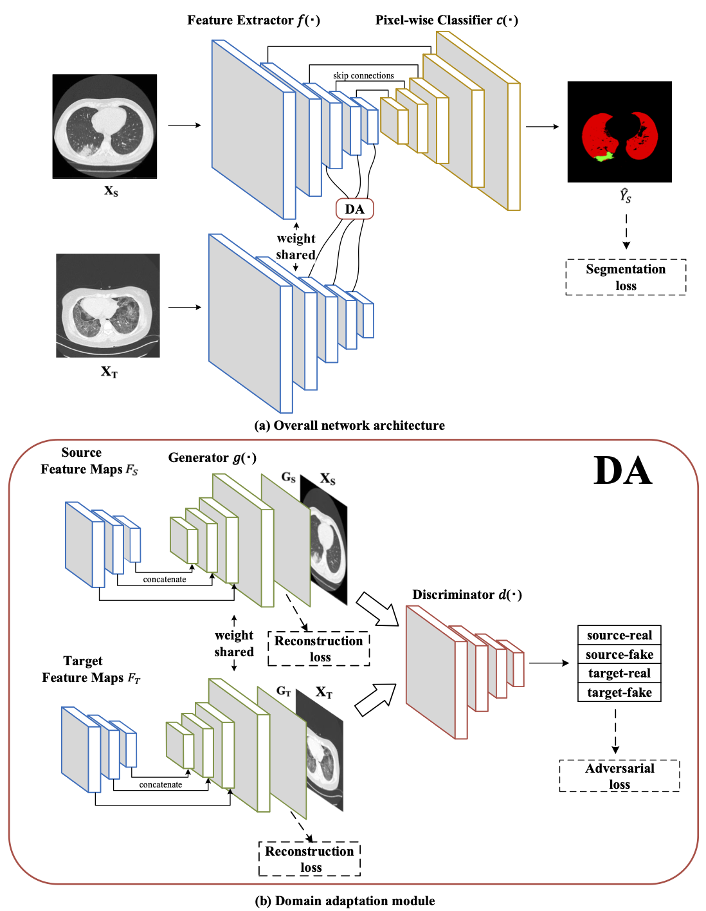

<p align="center">
  
</p>
<p align="center">
In this work, we designed a saliency detection model suitable for the target tracking task. Our proposed model takes a video as input and outputs the location of the most salient objects in the video, which benefits for improving the performance of downstream tracking network.  
</p>


# Abstract

Aiming at the problem that the current saliency detection models are not pertinent when dealing with tracking tasks and ignore the contribution of motion information to saliency, a Spatio-temporal saliency detection model suitable for target tracking tasks is proposed. In the spatial domain, the spatial saliency detection model based on histogram contrast is improved by introducing SLIC superpixel segmentation and prior information of the target position, and the complete and saliency target of each frame is obtained. In the time domain, the motion feature channel is added as the guidance method of the visual attention, and the motion vector is detected by the frame difference method and the optical flow method. The motion vector's saliency is analysed using the features of motion entropy and direction consistency, and then the time-domain salient model is constructed. Finally, saliency maps of the time-domain and spatial domain are merged using an adaptive weighting approach to obtain the Spatio-temporal saliency detection model that adapts to different tracking task situations.

# Overview

In this paper, we propose a novel unsupervised domain adaptation based segmentation network for COVID-19 CT infection segmentation task. The contributions of this paper can be summarized as follows: (1) we propose to make full use of synthetic data and limited unlabeled real COVID-19 CT images to jointly train the segmentation network, so as to introduce richer diversity; (2) we design a domain adaptation module to align the two domains and overcome the domain shift. It effectively improves the generalization capability of segmentation network; (3) we propose an unsupervised adversarial training scheme, in which the cross-domain adversarial loss will guide the segmentation network to learn domain-invariant feature, thus improving the segmentation performance. In the meanwhile, our training scheme is very flexible, as it can be arbitrarily combined with any segmentation network with encoder-decoder structure.

# COVID-19 CT Infection Segmentation Results
<p align="center">
  
</p>
<p align="center">
Qualitative results for two-class segmentation task. Columns 1 and 2 present the input real COVID-19 CT images and corresponding ground truth, while Column 6 is the segmentation result of our proposed method. The first to last rows are the results when taking ground-glass opacity (a), consolidation (b), infection (c) and the lung (d) as the segmentation object, respectively.
</p>


# Citation
```
@article{chen2022unsupervised,
  title={Unsupervised domain adaptation based COVID-19 CT infection segmentation network},
  author={Chen, Han and Jiang, Yifan and Loew, Murray and Ko, Hanseok},
  journal={Applied Intelligence},
  volume={52},
  number={6},
  pages={6340--6353},
  year={2022},
  publisher={Springer}
}
```
