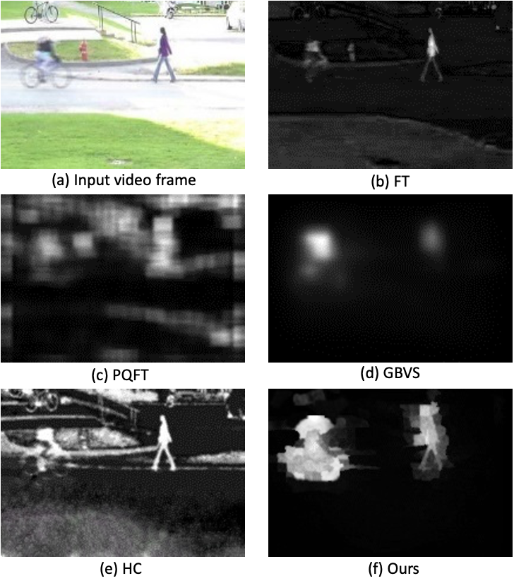

# Abstract

Automatic segmentation of infection areas in computed tomography (CT) images has proven to be an effective diagnostic approach for COVID-19. However, due to the limited number of pixel-level annotated medical images, accurate segmentation remains a major challenge. In this paper, we propose an unsupervised domain adaptation based segmentation network to improve the segmentation performance of the infection areas in COVID-19 CT images. In particular, we propose to utilize the synthetic data and limited unlabeled real COVID-19 CT images to jointly train the segmentation network. Furthermore, we develop a novel domain adaptation module, which is used to align the two domains and effectively improve the segmentation network’s generalization capability to the real domain. Besides, we propose an unsupervised adversarial training scheme, which encourages the segmentation network to learn the domain-invariant feature, so that the robust feature can be used for segmentation. Experimental results demonstrate that our method can achieve state-of-the-art segmentation performance on COVID-19 CT images.

# Overview

In this paper, we propose a novel unsupervised domain adaptation based segmentation network for COVID-19 CT infection segmentation task. The contributions of this paper can be summarized as follows: (1) we propose to make full use of synthetic data and limited unlabeled real COVID-19 CT images to jointly train the segmentation network, so as to introduce richer diversity; (2) we design a domain adaptation module to align the two domains and overcome the domain shift. It effectively improves the generalization capability of segmentation network; (3) we propose an unsupervised adversarial training scheme, in which the cross-domain adversarial loss will guide the segmentation network to learn domain-invariant feature, thus improving the segmentation performance. In the meanwhile, our training scheme is very flexible, as it can be arbitrarily combined with any segmentation network with encoder-decoder structure.

# COVID-19 CT Infection Segmentation Results

<p align="center">
Qualitative results for two-class segmentation task. Columns 1 and 2 present the input real COVID-19 CT images and corresponding ground truth, while Column 6 is the segmentation result of our proposed method. The first to last rows are the results when taking ground-glass opacity (a), consolidation (b), infection (c) and the lung (d) as the segmentation object, respectively.
</p>


<p align="center">
Qualitative results for multi-class segmentation task. Columns 1 and 2 show the input real COVID-19 CT images and corresponding ground truth, in which the ground-glass opacity is marked in blue, consolidation is marked in green, and the lung is marked in red. Columns 7 is the segmentation result for our proposed method.
</p>

# Acknowlegements
This research work is supported by the Air Force Office of Scientific Research (award number FA2386-19-1-4001).

# Citation
```
@article{chen2022unsupervised,
  title={Unsupervised domain adaptation based COVID-19 CT infection segmentation network},
  author={Chen, Han and Jiang, Yifan and Loew, Murray and Ko, Hanseok},
  journal={Applied Intelligence},
  volume={52},
  number={6},
  pages={6340--6353},
  year={2022},
  publisher={Springer}
}
```
